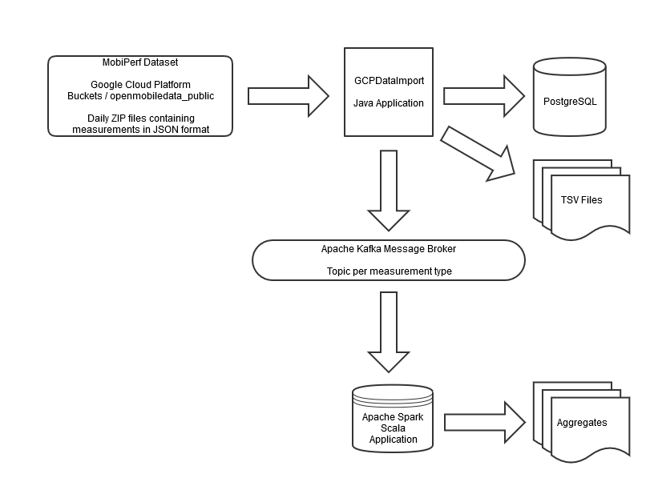

# Data Intensive Architecture Project

Stephen McMullan (x19139497@student.ncirl.ie)

Semester 2, Data Intensive Architectures, Postgraduate Diploma in Data Analytics

National College of Ireland

## GitHub Project Code Repository

https://github.com/smcmullan-ncirl/DIAProject

## About

https://www.measurementlab.net/

https://www.measurementlab.net/tests/mobiperf/

## Datasets

Processed 16809 files, 8564395 records in 9741 seconds at a rate of 879 records/sec

    ping : 3066411
    traceroute : 369750
    http : 819611
    dns_lookup : 1009149
    udp_burst : 13307
    tcpthroughput : 266445
    context : 291
    myspeedtest_ping : 1
    myspeedtestdns_lookup : 2
    device_info : 2681
    network_info : 2661
    battery_info : 2657
    ping_test : 3
    sim_info : 2651
    state_info : 2650
    usage_info : 2644
    rrc : 10846
    PageLoadTime : 1
    pageloadtime : 14169
    video : 3679
    sequential : 5163
    quic-http : 402207
    cronet-http : 401105
    multipath_latency : 2163380
    multipath_http : 2931

https://console.cloud.google.com/storage/browser/openmobiledata_public

## Prerequisites

The application was developed and tested on the following configuration:

    1. VM: Oracle VirtualBox 6.0
    2. Linux OS: Mint Linux 19.3
    3. RAM: 16GB
    4. CPU: 2 logical processors
    5. Disk Space: 50GB
    
The deployment of the Docker containers take approximately 3GB of disk
The clone of the GitHub repo is approx 7MB
The local Maven repository generated by the build consumes 250MB
Post build the application working directory is approx 33MB

## Architecture Diagram

 	
## Setup Build Environment Instructions

    sudo apt-get install maven
    sudo apt install git
    git clone https://github.com/smcmullan-ncirl/DIAProject.git
    cd DIAProject
    mvn clean package

## Setup Runtime Environment Instructions

First install Docker and add your user to the docker group

    sudo apt install docker.io
    sudo usermod -aG docker ${USER}
    sudo apt install docker-compose

You need to logout and log back in to take on the new group assignment

You can then check if Docker is running correctly by running the Hello World container
    
    docker run hello-world

## Run Instructions

    docker-compose up -d
    docker-compose ps
    docker-compose exec kafka kafka-topics.sh --create --replication-factor 1 --partitions 1 --bootstrap-server localhost:9092 --topic my-topic
    docker-compose exec kafka kafka-topics.sh --list --bootstrap-server localhost:9092

## Kafka Consumer Instructions

    docker-compose exec kafka kafka-console-consumer.sh --bootstrap-server localhost:9092 --topic <topic name>
    
I've provided a script to create all topics associated with this project

    createKafkaTopics.sh
    
However it isn't strictly necessary to do this as the topics are created by the broker when the client producer sends messages to those topics if they do not exist previously.

## Postgres Setup Instructions

    sudo apt-get install postgresql-client
    sudo apt install postgresql-client-common

## Starting Processing Instructons

    cd dia-data-import
    mvn exec:java
    
or

    java -jar dia-data-import/target/gcpdataimport-jar-with-dependencies.jar
    
## Shutdown Instructions

    docker-compose exec kafka kafka-topics.sh --delete --bootstrap-server localhost:9092 --topic <topic name>
    
I've provided a script to remove all topics associated with this project

    deleteKafkaTopics.sh
    
## Cleanup Instructions

A lot of diskspace can be consumed over time with Docker with containers, images and volumes. Some of the useful commands to see what is active and to remove it are as follows:

    docker ps
    docker stop <container name>
    docker rm <container name>
    docker images
    docker rmi <image name>
    
and finally Docker volumes under /var/lib/docker/volumes can be removed with:

    docker system prune --all --volumes

## Links

    https://spark.apache.org/docs/latest/structured-streaming-kafka-integration.html
    https://spark.apache.org/docs/latest/streaming-kafka-0-10-integration.html
    https://docs.databricks.com/spark/latest/dataframes-datasets/complex-nested-data.html
