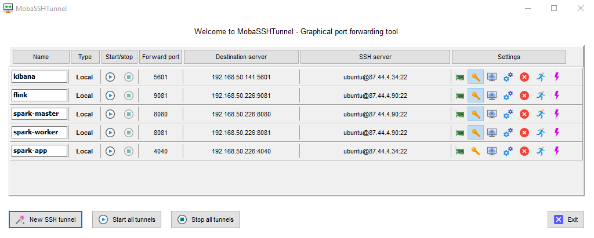

# Scalable Systems Programming Project

Stephen McMullan (x19139497@student.ncirl.ie)

Semester 3, Scalable Systems Programming, Postgraduate Diploma in Data Analytics

National College of Ireland

## GitHub Project Code Repository

[GitHub SSP Project](https://github.com/smcmullan-ncirl/SSPProject)

## Datasets

[Harvard Dataverse - Telecom Italia Datasets](https://dataverse.harvard.edu/dataset.xhtml?persistentId=doi:10.7910/DVN/QLCABU)

[1]Telecom Italia, ‘Telecommunications - SMS, Call, Internet - TN’. Harvard Dataverse, 2015, doi: 10.7910/DVN/QLCABU.

The repository for the data is at the following location on AWS:

[NCIRL AWS S3](https://s3.console.aws.amazon.com/s3/buckets/x19139497/Telecommunications%2520-%2520SMS%252C%2520Call%252C%2520Internet%2520-%2520TN/?region=eu-west-1&tab=overview)

### About the Telecom Italia Big Data Challenge

[Telecom Italia Big Data Challenge](https://www.nature.com/articles/sdata201555)

[1]G. Barlacchi et al., ‘A multi-source dataset of urban life in the city of Milan and the Province of Trentino’, 
Scientific Data, vol. 2, no. 1, Art. no. 1, Oct. 2015, doi: 10.1038/sdata.2015.55.

## Software Application Description

The project consists of three software applications plus their runtime platform and infrastructure:

1. **SSP Data Import**: this Java application uses the AWS SDK to stream CSV files containing the Telecom Data from AWS 
S3 which are stored as objects in a S3 bucket, transforms them to JSON format and sends them as a producer to a topic in 
Apache Kafka message broker. This application runs on a Java Virtual Machine runtime environment.

2. **SSP Spark Application**: this Scala application is written using the Spark API and deploys to the Apache Spark 
runtime platform running inside a Docker container. It acts as an Apache Kafka topic consumer, processes the topic 
messages in JSON format and converts them to objects using Jackson Object Mapping, provides Map/Reduce functionality to 
aggregate the totals for Calls In / Calls Out / SMS In / SMS Out on a per hourly/daily/weekly timestamp by country code
and writes out the aggregated records to an Elasticsearch index which is then queried using Kibana user interface for 
data representation.

3. **SSP Flink Application**: this Flink application is written using the Flink API and deploys to the Apache Flink 
runtime platform running inside a Docker container. It acts as an Apache Kafka topic consumer, processes the topic 
messages in JSON format and converts them to objects using Jackson Object Mapping, provides Map/Reduce functionality to 
aggregate the totals for Calls In / Calls Out / SMS In / SMS Out on a per hourly/daily/weekly timestamp by country code
and writes out the aggregated records to an Elasticsearch index which is then queried using Kibana user interface for 
data representation.

* Java 8
* Scala 2.11
* AWS SDK 2.13.7
* Apache Kafka Client API 2.5.0
* Apache Spark API 2.4.6
* Apache Flink API 1.10

### Setup Build Environment Instructions

The source code repository has been left in place on each OpenStack instance. The following steps should be performed
on all three instances: 

* x19139497-sspproj-1
* x19139497-sspproj-2
* x19139497-sspproj-3

    sudo apt-get update
    sudo apt-get upgrade
    
    sudo apt-get install openjdk-8-jdk
    sudo update-alternatives --config java (choose JDK8)
    
    sudo apt-get install maven
    sudo apt install git
    
    git clone https://github.com/smcmullan-ncirl/SSPProject.git (alternatively unzip the provided ZIP archive)
    
    cd SSPProject
    mvn clean package

### Runtime Environment Description

The runtime environment consists of the following:

1. **Amazon Web Services**: The Telecom Italia data is stored in objects inside an AWS S3 bucket

2. **Openstack**: The application runtime platform is deployed on 3 VM instances on OpenStack with the XLarge profile:
 
* x19139497-sspproj-1
* x19139497-sspproj-2
* x19139497-sspproj-3

The spec of each node is as follows:

    1. 8 virtual CPUs
    2. 16 GB of RAM
    3. 40 GB of disk
    4. Ubuntu 18.04 (Bionic Beaver) operating system
    
3. **Docker**: Each component of the application runtime platform is deployed as a standalone Docker container. This
provides a VM-like environment where the application runtime image is downloaded from DockerHub and run as a container
within the Docker runtime environment with its own operating system instance and application deployment.

4. **Apache Kafka**: Apache Kakfa is a clusterable, scalable Message Broker application whereby multiple applications 
acting as Producers can publish messages to Topics to be consumed by multiple applications acting as Consumers. The 
Producer in this instance is the SSP Data Import application and the Consumers are the SSP Spark App and the SSP Flink 
App. In other words Kafka acts as the Data Source with respect to Spark and Flink.

5. **Apache Spark**: Apache Spark is a clusterable, scalable concurrent data processing platform capable of sourcing
data from a variety of Data Sources, transforming the data sets using a variety of operators using the Map / Reduce
paradigm and sending the results to a variety of Data Sinks. It can operate in Batch mode, Mini-Batch / Streaming mode
or Continuous Streaming mode.

6. **Apache Flink**: Apache Flink is a clusterable, scalable concurrent data processing platform capable of sourcing
data from a variety of Data Sources, transforming the data sets using a variety of operators using the Map / Reduce
paradigm and sending the results to a variety of Data Sinks. It can operate in its primary Streaming mode or in Batch
mode.

7. **Elasticsearch**: Elasticsearch is a clusterable, scalable data store with RESTful search and analytics 
capabilities. It acts as the Data Sink for the aggregated Telecom data records produced by Spark and Flink.

8. **Kibana**: Kibana is a user interface that allows exploration and visualisation of the data indexed within
Elasticsearch.

* Docker IO 19.03
* Apache Kakfa 2.5.0
* Apache Spark 2.4.6
* Apache Flink 1.10
* Elasticsearch 7.8.1
* Kibana 7.8.1

#### Architecture Diagram
 	
# Overall Application Deployment

## Setup Runtime Environment Instructions

On each Openstack instance, perform the following steps:

1. First install Docker and add your user to the docker group.

    sudo apt-get update
    sudo apt-get upgrade
        
    sudo apt install docker.io
    sudo usermod -aG docker ${USER}
    sudo apt install docker-compose

2. You need to logout and log back in to take on the new group assignment.

3. You can then check if Docker is running correctly by running the Hello World container:
    
    docker run hello-world

## Run Instructions

Add the following to /etc/hosts on each OpenStack instance to allow the Kafka and Elasticsearch applications to be 
addressable by the software applications. The IP addresses and hostnames below represent the deployment in the NCIRL 
Openstack Cloud infrastructure:

    sudo vi /etc/hosts
    
    127.0.0.1 localhost
    192.168.50.192 x19139497-sspproj-1 kafka zookeeper
    192.168.50.226 x19139497-sspproj-2 spark flink
    192.168.50.141 x19139497-sspproj-3 elasticsearch kibana

Bring up the Docker environment on each environment:

x19139497-sspproj-1:

    docker-compose -f SSPProject/ssp-deployment/openstack-three-node/docker-compose-1.yml up -d
    docker-compose ps (Kafka and Zookeeper should be listed)

x19139497-sspproj-2:

    docker-compose -f SSPProject/ssp-deployment/openstack-three-node/docker-compose-2.yml up -d
    docker-compose ps (Spark Master, Spark Worker and Flink Job Manager, Task Manager should be listed)
    
x19139497-sspproj-3:

    docker-compose -f SSPProject/ssp-deployment/openstack-three-node/docker-compose-3.yml up -d
    docker-compose ps (Elastisearch and Kibana should be listed)

## SSPSparkApp - The Spark Streaming Processor application

### Building and deploying the application to Spark

A Spark Master and Spark Worker is deployed on the second Openstack instance, x19139497-sspproj-2

The application can be deployed to Spark on that host with the following commands:

    cd SSPProject/ssp-spark-app/target
    docker ps (should list the Docker containers referenced below)
    docker cp ssp-spark-app.jar openstack-three-node_spark-master_1:/
    docker cp ssp-spark-app.jar openstack-three-node_spark-worker_1:/
        
    docker exec -it openstack-three-node_spark-master_1 bin/spark-submit -v \
    --master spark://spark-master:7077 \
    --deploy-mode cluster \
    --class ie.ncirl.sspproject.dataprocess.SSPSparkApp \
    file:///ssp-spark-app.jar
    
## SSPFlinkApp - The Flink Streaming Processor application

### Building and deploying the application to Flink

A Flink Job Manager and Task Manager is deployed on the second Openstack instance, x19139497-sspproj-2

The application can be deployed to Flink on that host with the following commands:

    cd SSPProject/ssp-flink-app/target
    docker ps (should list the Docker containers referenced below)
    docker cp ssp-flink-app.jar penstack-three-node_flink-jobmanager_1:/
        
    docker exec -it openstack-three-node_flink-jobmanager_1 ./bin/flink run -d -p 8 \
    -c ie.ncirl.sspproject.dataprocess.SSPFlinkApp /ssp-flink-app.jar

## Starting Processing Instructions

### SSPDataImport - The Data Collection Processor application

A Kafka broker is deployed on the first Openstack instance, x19139497-sspproj-1

The following commands will start the processing of the data records from the AWS bucket to the Kafka broker.

    cd SSPProject/ssp-data-import
    
and then

    mvn exec:java
    
or

    java -jar target/ssp-data-import-jar-with-dependencies.jar

## Data Mining/Visualisation UI and other application management UIs

An Elasticsearch data sink and Kibana UI is deployed on the third Openstack instance, x19139497-sspproj-3

Access to the UI is achieved using SSH tunnelling and establishing local port forwarding to the target machine. The
following SSH tunnels can be established to access the Kibana UI and other application management UIs:

    Kibana: http://localhost:5601/app/kibana
    Spark Master UI: http://localhost:8080
    Spark Worker UI: http://localhost:8081
    Spark Application UI: http://localhost:4040
    Flink UI: http://localhost:9081
    
## Environment Shutdown Instructions

The Docker containers on each Openstack instance can be shutdown by:

x19139497-sspproj-1:

    docker-compose -f SSPProject/ssp-deployment/openstack-three-node/docker-compose-1.yml down

x19139497-sspproj-2:

    docker-compose -f SSPProject/ssp-deployment/openstack-three-node/docker-compose-2.yml down
    
x19139497-sspproj-3:

    docker-compose -f SSPProject/ssp-deployment/openstack-three-node/docker-compose-3.yml down
    
A lot of diskspace can be consumed over time with Docker with containers, images and volumes under 
/var/lib/docker/volume. These can all be removed by running the following command on all instance hosts:

    docker system prune --all --volumes

